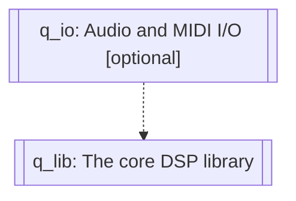

#  Audio DSP Library

## Introduction

Q is a cross-platform C++ library for audio digital signal processing. Q is named after the "Q factor," a dimensionless parameter that describes the quality of a resonant circuit. The Q DSP Library is designed to be simple and elegant, as the simplicity of its name suggests, and efficient enough to run on small microcontrollers.

Q simplifies complex DSP programming tasks without sacrificing readability by leveraging the power of modern C++ and efficient use of functional programming techniques, especially function composition using fine-grained and reusable function objects (both stateless and stateful).

Q is the host of some experimental Music related DSP facilities [the author](#jdeguzman) has accumulated over the years as part of research and development, and will continue to evolve to accommodate more facilities necessary for the fulfillment of various Music related projects.

The library is Open Source and released under the very liberal [MIT license](http://tinyurl.com/p6pekvo).

## Overview

The Q library has two layers:

1. *q_io*: Audio and MIDI I/O layer, with very minimal dependencies
   ([portaudio](http://www.portaudio.com/) and
   [portmidi](http://portmedia.sourceforge.net/portmidi/)) and very loose
   coupling via thin wrappers that are easy to transplant and port to a host,
   with or without an operating system, such as an audio plugin or direct to
   hardware ADC and DAC.

2. *q_lib*: The core DSP library, which has no dependencies except the
   standard c++ library. In the future, it is possible to make use additional
   libraries, as long as the libraries depended upon are also self-contained.
   *q_lib* is a no-frills, lightweight, header-only library.

The *q_io* layer provides cross-platform audio and MIDI host connectivity straight out of the box. The *q_io* layer is optional. The *q_lib* layer is usable without it. *q_io* is used in the tests and examples, but can be easily replaced by other mechanisms in an application.

## Documentation

* [Setup and Installation](docs/setup.md)
* [Quick Start](docs/quick_start.md)
* [Fundamentals](docs/fundamentals.md)
* [Units](docs/units.md)

## About the Author

Joel got into electronics and programming in the 80s because almost
everything in music, his first love, is becoming electronic and digital.
Since then, he builds his own guitars, effect boxes and synths. He enjoys
playing distortion-laden rock guitar, composes and produces his own music in
his home studio.

Joel de Guzman is the principal architect and engineer at [Cycfi
Research][1]. He is a software engineer specializing in advanced C++ and an
advocate of Open Source. He has authored a number of highly successful Open
Source projects such as [Boost.Spirit][3], [Boost.Phoenix][4] and
[Boost.Fusion][5]. These libraries are all part of the [Boost Libraries][6],
a well respected, peer-reviewed, Open Source, collaborative development
effort.

[1]: https://www.cycfi.com/
[2]: https://ciere.com/
[3]: http://tinyurl.com/ydhotlaf
[4]: http://tinyurl.com/y6vkeo5t
[5]: http://tinyurl.com/ybn5oq9v
[6]: http://tinyurl.com/jubgged

## Discord

Feel free to join the [discord channel](https://discord.gg/4MymV4EaY5) for
discussion and chat with the developer.

*Copyright (c) 2014-2023 Joel de Guzman. All rights reserved.*
*Distributed under the [MIT License](https://opensource.org/licenses/MIT)*

