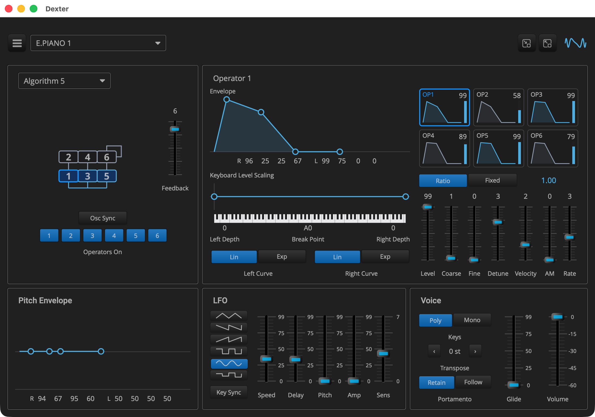

#  Audio DSP Library

## Introduction

is a cross-platform C++ library for Audio Digital Signal Processing. Aptly named after the "Q factor", a dimensionless parameter that describes the quality of a resonant circuit, the Q DSP Library is designed to be simple and elegant, as the simplicity of its name suggests, and efficient enough to run
on small microcontrollers.

Q leverages the power of modern C++ and efficient use of functional
programming techniques, especially function composition using fine-grained and reusable function objects (both stateless and stateful), to simplify complex DSP programming tasks without sacrificing readability.

Q is the host of some experimental Music related DSP facilities [the author](#jdeguzman) has accumulated over the years as part of research and development, and will continue to evolve to accommodate more facilities necessary for the fulfillment of various Music related projects.

The library is Open Source and released under the very liberal
[MIT License](https://opensource.org/licenses/MIT).

> **Status:** `master` tracks the latest stable release (currently v1.5.2). The next release, **v1.6**, is developed on `develop`, where the docs stay in sync as changes land. See [NEWS.md](NEWS.md) for what is new in each release.
>
> **Windows QPlug users: update to v1.5.2.** v1.5.0 and v1.5.1 fail when two different QPlug plugins have their editors open in one host: a "Could not register class" error and a crash on exit. See [NEWS.md](NEWS.md).

*[Dexter](https://cycfi.github.io/q/q/v1.6-dev/q_plug/tutorials/dexter.html), a high-fidelity Yamaha DX7 emulation, built with [QPlug](https://cycfi.github.io/q/q/v1.6-dev/q_plug/index.html): a library for building audio plugins using the Cycfi [Elements](https://github.com/cycfi/elements) GUI library. QPlug is an optional library in the Q ecosystem.*

## Highlights

**Modern C++**

* [Type-Safe Units: 440_Hz, 10_ms, -6_dB](https://cycfi.github.io/q/q/v1.6-dev/reference/units.html#_overview)
* [C++20 Concepts and Composable Function Objects](https://cycfi.github.io/q/q/v1.6-dev/fundamentals.html#_function_objects)
* [Highly Reusable, Modular Building Blocks](https://cycfi.github.io/q/q/v1.6-dev/reference/q_lib.html#_contents)
* [Header-Only DSP Core, No Third-Party Dependencies](#dependencies)
* [MIT License](LICENSE)

**Desktop to Microcontroller**

* [macOS, Windows and Linux](https://cycfi.github.io/q/q/v1.6-dev/setup.html#_supported_platforms_and_compilers)
* [Microcontrollers with an FPU and a C++20 Compiler: Tested on STM32 with Arm GCC 12](https://cycfi.github.io/q/q/v1.6-dev/microcontrollers.html)

**MIDI 2.0**

* [Full MIDI 2.0: UMP, Per-Note Expression, MPE, MIDI-CI](https://cycfi.github.io/q/q/v1.6-dev/reference/midi.html#_overview)
* [MIDI 1.0 and 2.0 Translation, Both Ways](https://cycfi.github.io/q/q/v1.6-dev/reference/midi/translation.html#_overview)
* [Conformance Tests, Clause by Clause: UMP, MIDI-CI, MPE](https://cycfi.github.io/q/q/v1.6-dev/reference/midi/conformance.html#_against_the_specification_text)
* [Verified with the MIDI Association Workbench, Including Over USB on a Device Running Q Firmware](https://cycfi.github.io/q/q/v1.6-dev/reference/midi/conformance.html#_over_usb)

**Signal Processing**

* [BACF Pitch Detection: Sub-Cent Accuracy](https://cycfi.github.io/q/q/v1.6-dev/reference/pitch.html#_overview)
* [Signal Conditioning for Real Instruments](https://cycfi.github.io/q/q/v1.6-dev/reference/misc/signal_conditioner.html#_overview)
* [Biquad Filters](https://cycfi.github.io/q/q/v1.6-dev/reference/biquad.html#_overview)
* [Resonant Filters: State Variable, Moog and OTA Ladders](https://cycfi.github.io/q/q/v1.6-dev/reference/resonant.html#_overview)
* [Virtual Analog Synthesis](https://cycfi.github.io/q/q/v1.6-dev/reference/synth/va.html#_overview)
* [FM Synthesis: High-Fidelity DX7 Emulation](https://cycfi.github.io/q/q/v1.6-dev/reference/synth/fm.html#_a_clean_room_dx7)
* [Granular Synthesis](https://cycfi.github.io/q/q/v1.6-dev/reference/synth/grain.html#_overview)
* [Delay Lines and Fractional Ring Buffers with Interpolation](https://cycfi.github.io/q/q/v1.6-dev/reference/misc/delay.html#_overview)
* [Envelope Followers: Peak, RMS, True RMS](https://cycfi.github.io/q/q/v1.6-dev/reference/envelope.html)
* [Dynamics: Compressor, Expander, AGC](https://cycfi.github.io/q/q/v1.6-dev/reference/dynamic.html#_overview)
* [Generators: Envelopes, LFOs, Windows, Noise](https://cycfi.github.io/q/q/v1.6-dev/reference/synth.html#_generator)
* [Fast Math: Exp, Log, Pow and Decibel Approximations](https://cycfi.github.io/q/q/v1.6-dev/reference/support/fast_math.html#_overview)

**Plugins and I/O**

* [CLAP-First Plugins, Wrapped by clap-wrapper for VST3, AudioUnit and Standalone](https://cycfi.github.io/q/q/v1.6-dev/q_plug/architecture.html#_one_implementation_three_formats)
* [GUI with the Modern Elements C++ GUI Library](https://cycfi.github.io/q/q/v1.6-dev/q_plug/reference/presenter.html#_overview)
* [Parameters, Presets, Saved State and HiDPI Zoom, Built In](https://cycfi.github.io/q/q/v1.6-dev/q_plug/reference/controller.html#_overview)
* [Cross-Platform Audio and MIDI I/O, With Audio and MIDI Files](https://cycfi.github.io/q/q/v1.6-dev/reference/q_io.html#_overview)

**Learning**

* [19 Step-by-Step Tutorials: From a Sine Wave to a DX7 Synth](https://cycfi.github.io/q/q/v1.6-dev/tutorials.html#_overview)

## Three Layers

Q comes in three layers. The core stands on its own; the other two are optional and each builds on it.

**Q, the core (`q_lib`):** The DSP library proper: filters, envelopes and dynamics, oscillators and synthesis, pitch detection, MIDI 1.0 and 2.0, and the support facilities they share. It is header-only and needs only the C++ standard library and the header-only Cycfi infra, so it runs on small microcontrollers as readily as on a desktop. See the [Q Reference](https://cycfi.github.io/q/q/v1.6-dev/reference/q_lib.html).

**QIO (`q_io`):** Audio and MIDI input and output for a desktop application: devices, streams and audio files, built on RtAudio and libremidi. The tests and examples use it; an application with its own I/O, a plugin for one, does without it. See the [QIO Reference](https://cycfi.github.io/q/q/v1.6-dev/reference/q_io.html).

**QPlug (`q_plug`):** A framework for building audio plugins: write the DSP, the parameters and an Elements GUI as three plain classes, and get CLAP, VST3 and AudioUnit plugins and a standalone app. It is off by default. See the [QPlug Reference](https://cycfi.github.io/q/q/v1.6-dev/q_plug/index.html).

## Dependencies

None is installed by hand: CMake brings each in, pinned, the first time you configure.

**Q, the core (`q_lib`):** Only the C++ standard library and the header-only [Cycfi infra](https://github.com/cycfi/infra), a git submodule. A clone without the submodule still builds: CMake fetches infra instead.

**QIO (`q_io`):** [RtAudio](https://github.com/thestk/rtaudio) for audio and [libremidi](https://github.com/celtera/libremidi) for MIDI 1.0 and 2.0, libremidi from a Cycfi fork that carries bug fixes sent upstream.

**QPlug (`q_plug`):** [Elements](https://github.com/cycfi/elements) for the GUI, [CLAP](https://github.com/cycfi/clap) and [clap-wrapper](https://github.com/free-audio/clap-wrapper) for the plugin formats and the standalone app, and [nlohmann json](https://github.com/nlohmann/json) for state and presets. Fetched only when QPlug is built.

The compiler, CMake and the few system packages each platform needs are in [Q Setup and Installation](https://cycfi.github.io/q/q/v1.6-dev/setup.html#_dependencies) and [QPlug Setup and Installation](https://cycfi.github.io/q/q/v1.6-dev/q_plug/setup.html#_dependencies).

## Where to Start

The documentation follows the path through Q:

1. **Set up.** [Q Setup and Installation](https://cycfi.github.io/q/q/v1.6-dev/setup.html) builds Q and QIO with their tests and examples; [QPlug Setup and Installation](https://cycfi.github.io/q/q/v1.6-dev/q_plug/setup.html) adds what plugins need.
2. **Learn by example.** The [Q Tutorials](https://cycfi.github.io/q/q/v1.6-dev/tutorials/index.html) go from a sine oscillator to polyphonic synths, easiest first; the [QPlug Tutorials](https://cycfi.github.io/q/q/v1.6-dev/q_plug/tutorials/index.html) build a plugin.
3. **Look things up.** The [Q Reference](https://cycfi.github.io/q/q/v1.6-dev/reference/q_lib.html), which opens with [Fundamentals](https://cycfi.github.io/q/q/v1.6-dev/fundamentals.html), the [QIO Reference](https://cycfi.github.io/q/q/v1.6-dev/reference/q_io.html) and the [QPlug Reference](https://cycfi.github.io/q/q/v1.6-dev/q_plug/index.html).

## The Author

Joel got into electronics and programming in the 80s because almost
everything in music, his first love, is becoming electronic and digital.
Since then, he builds his own guitars, effect boxes and synths. He enjoys
playing distortion-laden rock guitar, composes and produces his own music in
his home studio.

Joel de Guzman is the principal architect and engineer at [Cycfi
Research][1]. He is a software engineer specializing in advanced C++ and an
advocate of Open Source. He has authored a number of highly successful Open
Source projects such as [Boost.Spirit][3], [Boost.Phoenix][4] and
[Boost.Fusion][5]. These libraries are all part of the [Boost Libraries][6],
a well respected, peer-reviewed, Open Source, collaborative development
effort.

[1]: https://www.cycfi.com/
[2]: https://ciere.com/
[3]: http://tinyurl.com/ydhotlaf
[4]: http://tinyurl.com/y6vkeo5t
[5]: http://tinyurl.com/ybn5oq9v
[6]: http://tinyurl.com/jubgged

## Discord

Join the [Discord channel](https://discord.gg/4MymV4EaY5) to discuss Q and chat with the developer.

*Copyright (c) 2014-2026 Joel de Guzman. All rights reserved.*
*Distributed under the [MIT License](https://opensource.org/licenses/MIT)*
